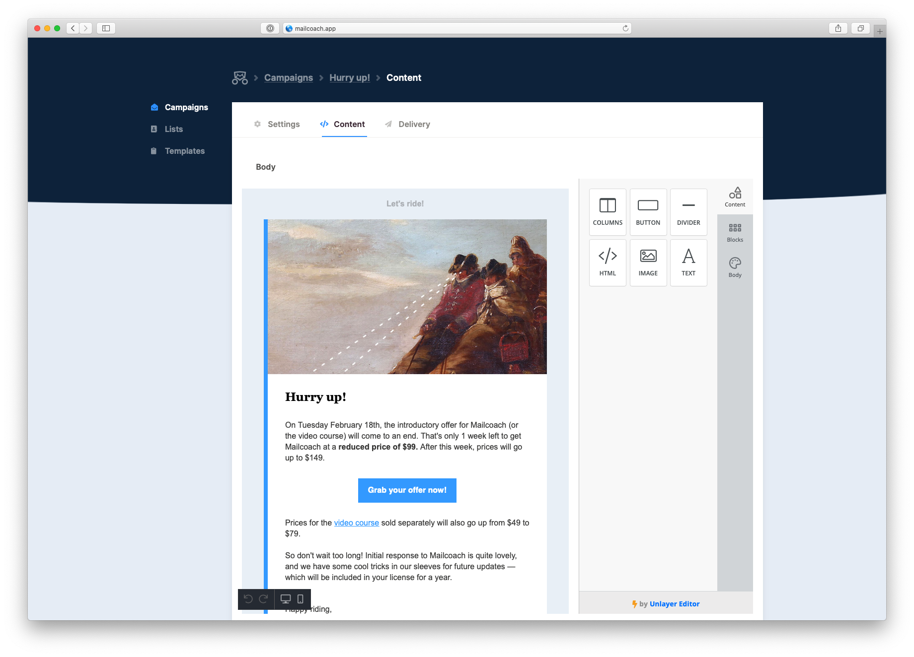

# Mailcoach Unlayer Editor

This package is an optional add on for [Mailcoach](https://mailcoach.app).
 
When installed, it adds the free version of [Unlayer editor](https://unlayer.com), a beautiful drag and drop editor, to Mailcoach. 



## Support us

[](https://spatie.be/github-ad-click/laravel-mailcoach-unlayer)

We invest a lot of resources into creating [best in class open source packages](https://spatie.be/open-source). You can support us by [buying one of our paid products](https://spatie.be/open-source/support-us).

We highly appreciate you sending us a postcard from your hometown, mentioning which of our package(s) you are using. You'll find our address on [our contact page](https://spatie.be/about-us). We publish all received postcards on [our virtual postcard wall](https://spatie.be/open-source/postcards).

## Documentation

You'll find the documentation for this package [inside the Mailcoach docs](https://spatie.be/docs/laravel-mailcoach/v4/choosing-an-editor/unlayer).

## Testing

```bash
composer test
```

## Changelog

Please see [CHANGELOG](CHANGELOG.md) for more information on what has changed recently.

## Contributing

Please see [CONTRIBUTING](CONTRIBUTING.md) for details.

## Security

If you discover any security related issues, please email freek@spatie.be instead of using the issue tracker.

## Credits

- [Rias Van der Veken](https://github.com/riasvdv)
- [All Contributors](../../contributors)
